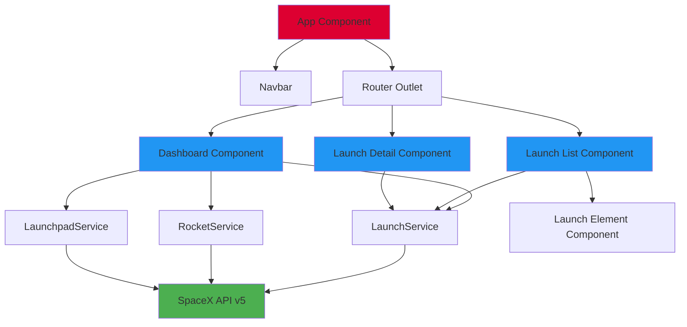

# SpaceX Dashboard

Une application Angular moderne pour explorer les lancements SpaceX et visualiser des statistiques détaillées sur les missions spatiales.


---

##  Table des Matières

- [Vue d'ensemble](#-vue-densemble)
- [Fonctionnalités](#-fonctionnalités)
- [Architecture](#-architecture)
- [Technologies Utilisées](#-technologies-utilisées)
- [Démarrage Rapide](#-démarrage-rapide)
- [Utilisation de l'IA](#-utilisation-de-lia)
- [Structure du Projet](#-structure-du-projet)
- [API SpaceX](#-api-spacex)

---

## Vue d'ensemble

SpaceX Dashboard est une application web interactive qui permet d'explorer l'historique complet des lancements SpaceX. Elle offre une interface moderne avec des visualisations graphiques et une navigation intuitive pour découvrir les missions passées, en cours et à venir.

### Objectifs du Projet

- Créer une interface utilisateur moderne et réactive
- Visualiser les données SpaceX de manière claire et interactive
- Implémenter des fonctionnalités de pagination et de filtrage avancées
- Respecter les meilleures pratiques Angular modernes (v20+)

---

## Fonctionnalités

### Dashboard Analytique

Tableau de bord complet avec 4 graphiques interactifs :

- **Lancements par Année** : Graphique en barres montrant l'évolution du nombre de lancements
- **Taux de Réussite** : Graphique circulaire affichant le ratio succès/échec
- **Types de Fusées** : Graphique en anneau présentant la distribution par type de fusée
- **Sites de Lancement** : Graphique horizontal des 10 sites les plus utilisés

### Liste des Lancements

- **Pagination Intelligente** : Affichage par 10, 20 ou 50 lancements
- **Filtrage Dynamique** : Basculer entre lancements à venir et passés
- **Navigation** : Pagination avec boutons précédent/suivant et accès direct aux pages
- **Aperçu Compact** : Cartes affichant le nom, la date, le statut et la fusée

### Détails des Lancements

Vue détaillée de chaque mission incluant :

- Nom de la mission et numéro de vol
- Date et heure du lancement (UTC)
- Succès/échec de la mission
- Type de fusée utilisé
- Site de lancement
- Description complète de la mission
- Liens vers articles et vidéos
- Images et patches de mission

### Interface Utilisateur

- **Design Moderne** : Interface sombre avec fond étoilé animé
- **Responsive** : Optimisé pour desktop
- **Navigation** : Barre de navigation fixe
- **Performances** : Chargement rapide et mise en cache

---

## Architecture

### Architecture Générale



### Organisation des Modules

L'application suit une **architecture feature-based** :

#### **Core Module** (`src/app/core`)
Services partagés dans toute l'application :
- `LaunchService` : Gestion des lancements (récupération, pagination, filtrage)
- `RocketService` : Informations sur les fusées
- `LaunchpadService` : Données des sites de lancement

#### **Features Module** (`src/app/features`)
Modules fonctionnels organisés par domaine :
- `launch/` : 
  - `launch-list.component` : Liste paginée avec filtres
  - `launch-element.component` : Carte de lancement individuelle
  - `launch-detail.component` : Vue détaillée d'un lancement

#### **Shared Module** (`src/app/shared`)
Composants réutilisables :
- `navbar.component` : Barre de navigation
- `dashboard.component` : Tableau de bord analytique
- `starfield-background.component` : Arrière-plan animé
- `pipes/` : Pipes personnalisés (date, filtres)

#### **Models** (`src/app/models`)
Interfaces TypeScript :
- `launch.interface.ts` : Modèle de données des lancements
- `rocket.interface.ts` : Modèle des fusées
- `launchpad.interface.ts` : Modèle des sites de lancement
- `query.interface.ts` : Réponses API paginées

### Principes Architecturaux

#### **Standalone Components**
Tous les composants utilisent l'API standalone d'Angular 20 :
```typescript
@Component({
  selector: 'app-launch-list',
  standalone: true,
  imports: [CommonModule, FormsModule, LaunchElementComponent],
  // ...
})
```

#### **Signals & Reactive Programming**
Gestion d'état moderne avec Angular Signals :
```typescript
launchList = signal<Launch[]>([]);
currentPage = signal(1);
totalPages = computed(() => Math.ceil(this.totalItems() / this.pageSize()));
```

#### **Control Flow Moderne**
Utilisation de la syntaxe `@if`, `@for`, `@switch` au lieu des directives classiques

#### **Dependency Injection**
Injection de dépendances avec la fonction `inject()` :
```typescript
private spacexService = inject(LaunchService);
```

---

## Technologies Utilisées

| Technologie | Version | Utilisation |
|------------|---------|-------------|
| **Angular** | 20.3 | Framework principal |
| **TypeScript** | 5.9 | Langage de programmation |
| **Chart.js** | 4.5 | Visualisations graphiques |
| **ng2-charts** | 8.0 | Wrapper Angular pour Chart.js |
| **RxJS** | 7.8 | Programmation réactive |
| **Vanilla CSS** | - | Styling sans framework |

### Dépendances Principales

```json
{
  "@angular/core": "^20.3.0",
  "@angular/router": "^20.3.0",
  "@angular/forms": "^20.3.0",
  "chart.js": "^4.5.1",
  "ng2-charts": "^8.0.0",
  "rxjs": "~7.8.0"
}
```

---

## Démarrage Rapide

### Prérequis

- **Node.js** : v18 ou supérieur
- **npm** : v9 ou supérieur
- **Angular CLI** : v20 (installé automatiquement)

### Installation

1. **Cloner le repository** :
   ```bash
   cd /Users/leojj/Desktop/A3-IMT/Web/SpaceX-Dashboard/spacex-app
   ```

2. **Installer les dépendances** :
   ```bash
   npm install
   ```

3. **Lancer le serveur de développement** :
   ```bash
   npm start
   # ou
   ng serve
   ```

4. **Ouvrir l'application** :
   Naviguer vers `http://localhost:4200` dans votre navigateur

### Commandes Disponibles

```bash
# Développement
npm start              # Démarre le serveur de développement
ng serve --open        # Démarre et ouvre automatiquement le navigateur

# Build
npm run build          # Build de production
ng build --configuration production

# Linting
ng lint                # Vérifie la qualité du code
```

---

## Utilisation de l'IA

L'intelligence artificielle a été utilisée pour réaliser le fond étoilé animé.
Elle a également contribué à rédiger le README et comme outil d'auto-complétion durant le développement.

## Tests

Par cause de manque de temps, aucun test n'a été implémenté dans ce projet.

## 📁 Structure du Projet

```
spacex-app/
├── src/
│   ├── app/
│   │   ├── core/                    # Services singleton
│   │   │   ├── launch.service.ts
│   │   │   ├── rocket.service.ts
│   │   │   └── launchpad.service.ts
│   │   │
│   │   ├── features/                # Modules fonctionnels
│   │   │   └── launch/
│   │   │       ├── launch-list/
│   │   │       │   ├── launch-list.component.ts
│   │   │       │   ├── launch-list.component.html
│   │   │       │   └── launch-list.component.css
│   │   │       ├── launch-detail/
│   │   │       └── launch-element/
│   │   │
│   │   ├── shared/                  # Composants partagés
│   │   │   ├── navbar/
│   │   │   ├── dashboard/
│   │   │   ├── starfield-background.component.ts
│   │   │   └── pipes/
│   │   │
│   │   ├── models/                  # Interfaces TypeScript
│   │   │   ├── launch.interface.ts
│   │   │   ├── rocket.interface.ts
│   │   │   └── query.interface.ts
│   │   │
│   │   ├── app.routes.ts            # Configuration des routes
│   │   ├── app.config.ts            # Configuration globale
│   │   └── app.ts                   # Composant racine
│   │
│   ├── index.html                   # Point d'entrée HTML
│   └── styles.css                   # Styles globaux
│
├── package.json                     # Dépendances npm
├── tsconfig.json                    # Configuration TypeScript
├── angular.json                     # Configuration Angular
└── README.md                        # Ce fichier
```

---

## API SpaceX

### Endpoints Utilisés

#### 1. **Récupérer tous les lancements**
```http
GET https://api.spacexdata.com/v5/launches
```

#### 2. **Récupérer un lancement par ID**
```http
GET https://api.spacexdata.com/v5/launches/{id}
```

#### 3. **Lancements paginés avec filtres**
```http
POST https://api.spacexdata.com/v5/launches/query
Content-Type: application/json

{
  "query": { "upcoming": true },
  "options": {
    "sort": { "date_utc": "asc" },
    "limit": 10,
    "page": 1
  }
}
```

#### 4. **Fusées**
```http
GET https://api.spacexdata.com/v4/rockets
```

#### 5. **Sites de lancement**
```http
GET https://api.spacexdata.com/v4/launchpads
```

### Documentation Officielle

📚 [SpaceX API Documentation](https://github.com/r-spacex/SpaceX-API/tree/master/docs)

---


<div align="center">

[⬆ Retour en haut](#spacex-dashboard-)

</div>
